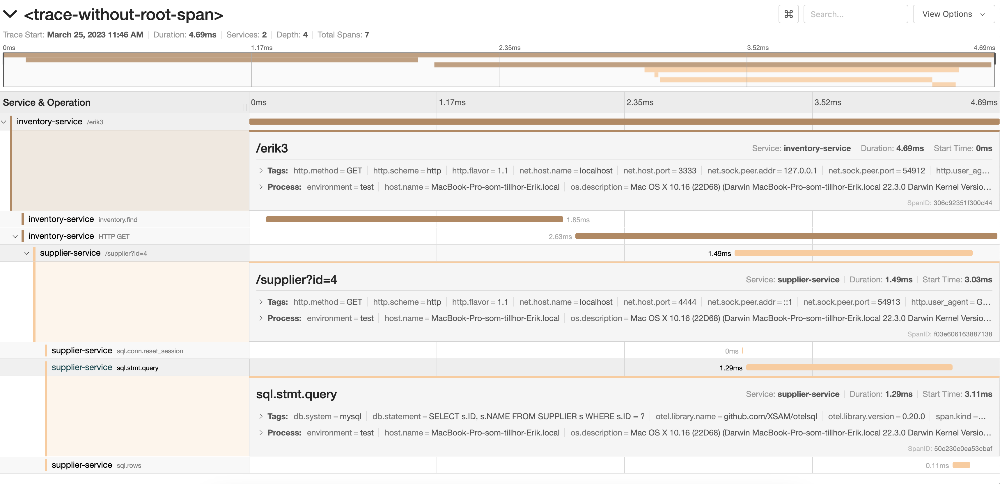

# Opentelemetry demoapp in Go

Sets up a make-believe scenario with two microservices:

* Inventory service - calls MongoDB and the Supplier Service
* Supplier service - calls MySQL

Use a bunch of different console windows.

Start Jeager:
```
docker run --name jaeger \
  -e COLLECTOR_ZIPKIN_HTTP_PORT=9411 \
  -p 5775:5775/udp \
  -p 6831:6831/udp \
  -p 6832:6832/udp \
  -p 5778:5778 \
  -p 16686:16686 \
  -p 14268:14268 \
  -p 9411:9411 \
  jaegertracing/all-in-one:1.6
```

Start MongoDB:
```
docker run -p 27017:27017 mongo:latest
```

Start MySQL
```
docker run --name test -p 3306:3306 -e MYSQL_ROOT_PASSWORD=my-secret-pw mysql:latest
```

Note! Currently, you need to use a separate DB client to create the `test` database as well as creating the SUPPLIER table and a line in it:
```sql
CREATE TABLE SUPPLIER (
      ID VARCHAR(64) PRIMARY KEY,
      NAME VARCHAR(128)
);

INSERT INTO SUPPLIER VALUES(4, 'Acme Inc.');
```

Start Inventory service:
```
go run cmd/inventory/main.go 
```

Start Supplier service:
```
go run cmd/supplier/main.go
```

Finally, call the inventory service using curl with a [trace context](https://www.w3.org/TR/trace-context/#traceparent-header-field-values) header:

```
curl localhost:3333/erik3 -H 'traceparent:00-4bf92f3577b34da6a3ce929d0e0e4799-a3ce929d0e0e4799-01'
```

Navigate to Jaeger's GUI at http://localhost:16686/ and explore your trace!

